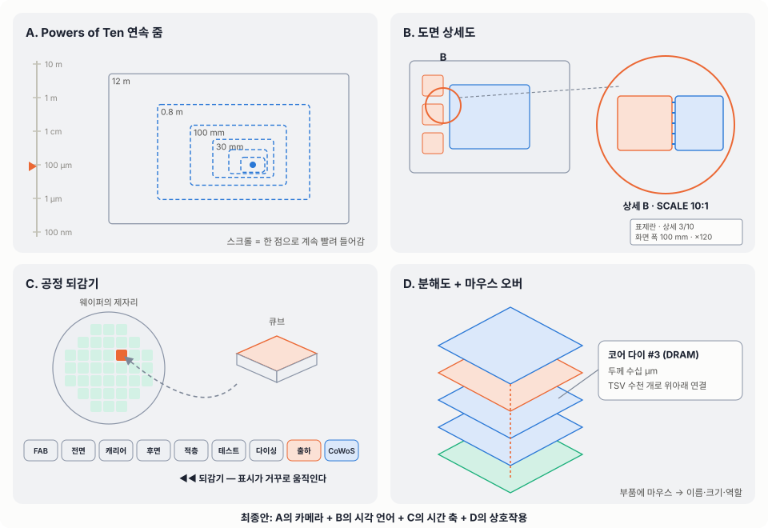

# HBM 역추적 — AI에서 DRAM 셀까지 (초안 · 표현안 · 최종안)

> engr-edu HTML의 새 탭 **「HBM 역추적」** 의 기획 문서입니다.
> 설명 방식: **큰 것에서 작은 것으로 스케일을 줄이며(scale down) 거꾸로 따라가는 것**.
> "AI가 빠르려면 무엇이 필요하지? → 그건 어디서 오지? → 그건 어떻게 만들었지?"를 반복합니다.
> 공개 저장소이므로 수치는 공개 자료 기준의 대략값이고, 사내 공정 조건은 넣지 않았습니다.

---

## 1. 흐름 초안 — 10개 장(章), 12개 장면

화면 폭은 각 장면이 보여 주는 실제 크기입니다. 처음 12 m에서 마지막 0.15 µm까지 **약 1억 배(10⁸)** 를 줌인합니다.

| # | 장(章) | 역추적 질문 | 화면에 그리는 것 | 화면 폭 | 다음으로 넘어가는 방식 |
|---|---|---|---|---|---|
| 1 | AI | AI는 왜 메모리에 목마를까? | 데이터센터 랙 열(위에서 본 모습), AI 답변 토큰이 흘러나옴 | 12 m | 랙 속 서버로 **줌인 ×15** |
| 2 | 서버 | AI 서버 한 대 안에는? | 8-GPU 서버 내부: GPU 8개, 스위치, CPU+DDR5, 팬, 전원 | 0.8 m | GPU 패키지로 **줌인 ×8** |
| 3 | HBM의 역할 | HBM은 GPU 옆에서 무엇을 하나? | GPU 패키지 위에서 본 모습: GPU 칩, HBM 8개, 데이터선(1,024/2,048개)이 흐름 | 100 mm | 단면 A–A′로 **자르기** |
| 4 | CoWoS 실장 | HBM은 어디서 GPU 옆에 붙나? | 단면: 리드·TIM·GPU·HBM·마이크로범프·인터포저·C4·기판·BGA·보드 | 30 mm | 실장 전으로 **되감기 ◀◀** |
| 5 | 출하 | 어떤 상태로 도착했나? | HBM 큐브(KGSD), 트레이, 최종 검사, 윗면 ID | 30 mm | ID가 가리키는 웨이퍼 자리로 **되감기 + 줌아웃** |
| 6 | 스택 웨이퍼 | 큐브는 어디서 잘려 나왔나? | 300 mm 스택 웨이퍼: 웨이퍼 맵(합격·불합격), 분석, 다이싱 | 520 mm | 그 칸 안으로 **줌인 ×32** |
| 7 | 적층 | 스택은 어떻게 쌓였나? | 베이스 다이 + 코어 다이 8~16장, TSV, 마이크로범프, 몰드 (절단도·분해도) | 16 mm | 접합부로 **줌인 ×80 + 되감기** |
| 8 | 후면 범프 | 다이 뒷면의 패드는? | 캐리어 위에 뒤집힌 웨이퍼: 그라인딩 → TSV 노출 → 절연막 → CMP → 후면 패드 | 200 µm | 캐리어를 떼고 **뒤집기 ◀◀** |
| 9 | 전면 범프·캐리어 | 앞면 범프는 어떻게 만들었나? | 범프 도금(Cu → Ni → SnAg) → 리플로우 → 캐리어 본딩 | 60 µm | 범프 아래 칩 속으로 **줌인 ×2** |
| 10 | DRAM 제작 | 칩 속에는? | ① 다이 단면(BEOL·셀·TSV) ② 커패시터 숲 ③ 셀 하나(1T1C) | 30 µm → 2 µm → 0.15 µm | 끝 → **제조 순서로 다시 보기(줌아웃)** |

### 장면마다 직접 해 보기

| 장면 | 직접 해 보기 |
|---|---|
| 1 AI | **토큰 레이스** — 모델 크기·정밀도·대역폭을 바꾸면 HBM 가속기와 DDR 서버가 답을 쓰는 속도가 달라진다 |
| 2 서버 | **서버 한 대 = HBM 몇 개?** — GPU 수 × GPU당 스택 × 스택 용량 |
| 3 HBM 역할 | **스택 대역폭 계산** — HBM3/3E/4 선택 → 데이터선 수와 화면의 데이터선 개수가 바뀜 |
| 4 CoWoS | **조립 순서** — 스크롤하면 인터포저 → 언더필 → C4 → 기판·리드 → 보드 순서로 쌓임 |
| 5 출하 | **ID 역추적** — 큐브의 ID에 마우스를 올리면 lot·웨이퍼·좌표가 보임 |
| 6 스택 웨이퍼 | **맵 패턴**(가장자리형/국부형/랜덤형)과 원인 후보, **패키지 수율** = GPU 수율 × HBM 수율^스택 수 |
| 7 적층 | **높이 예산** — 8/12/16단, 720/775 µm, 접합부 두께 → 코어 다이 두께 (화면의 단수도 바뀜) |
| 8 후면 범프 | 스크롤로 6단계 공정이 화면에서 진행 |
| 9 전면 범프 | 스크롤로 9단계 범프 도금·캐리어 본딩 진행 (★ 범프 도금 공정) |
| 10 DRAM | TSV 형성 6단계(via-middle), 셀의 전하 저장·읽기 |

---

## 2. 표현 방식 예시 — 어떻게 멋있게 보여 줄까



### A. Powers of Ten 연속 줌
- 1977년 영화 *Powers of Ten*(Eames)처럼, 스크롤하면 화면이 한 점으로 **계속 빨려 들어갑니다**.
- 왼쪽의 **로그 눈금(10 m → 100 nm)** 위로 표시가 내려가고, 화면 아래 **축척 막대**가 m → mm → µm → nm로 바뀝니다.
- 장점: "얼마나 작아지는지"가 몸으로 느껴집니다. 단점: 화면이 바뀔 때 무엇을 보는지 놓칠 수 있습니다.

### B. 도면 상세도(Detail View)
- 엔지니어링 도면의 **상세 원(○B)** 처럼, 다음에 들어갈 자리를 점선 상자로 표시하고 "상세 → 서버 한 대"라고 적어 둡니다.
- 화면 구석의 **표제란**에 상세 번호, 화면 폭, 실물 대비 배율을 적습니다.
- 장점: 엔지니어에게 익숙한 시각 언어이고, 다음에 어디로 갈지 미리 보입니다.

### C. 공정 되감기(Rewind)
- 시간도 거꾸로 돌립니다. 큐브가 **웨이퍼 제자리로 돌아가고**, 적층이 **한 층씩 떨어지고**, 웨이퍼가 **캐리어에서 떨어져 뒤집힙니다**.
- 화면 아래 **공정 타임라인**(DRAM 웨이퍼 → … → 서버) 위의 표시가 거꾸로 움직이고, 되감을 때는 ◀◀ 표시와 주사선 효과가 나옵니다.
- 장점: 공간(크기)과 시간(공정 순서)을 동시에 따라갈 수 있습니다.

### D. 분해도 + 마우스 오버
- 부품에 마우스를 올리면 이름·크기·역할이 뜹니다. 적층은 분해도로 한 층씩 떼어 봅니다.
- 장점: 발표자가 말로 설명하지 않아도 신입이 스스로 탐색할 수 있습니다.

---

## 3. 최종안 — A + B + C + D 조합

```
┌────────────────────────── 무대(고정) ──────────────────────────┬──── 카드(스크롤) ────┐
│ [AI ▸ 서버 ▸ HBM 역할 ▸ CoWoS ▸ 출하 ▸ 웨이퍼 ▸ 적층 ▸ …]  ← 장 이동 │  역추적 4 · CoWoS     │
│                                                              │  Q. HBM은 어디서…?    │
│ 10 m ┬                                                       │  · 2.5D 패키징        │
│  1 m ┤        (장면 SVG — 줌·자르기·되감기 전환)              │  · 조립 순서 ①~⑤      │
│ 10 cm┤◀ 현재       ┌ ─ ─ ─ ┐                                 │  [직접 해 보기]        │
│  …   ┤             │ 상세 → │ ← 다음에 들어갈 자리             │                      │
│100 nm┴             └ ─ ─ ─ ┘                                 │  다음 질문 ↓          │
│ ├──┤ 1 mm  · 화면 폭 30 mm · ×400 확대                        │                      │
│ DRAM ▸ 전면범프 ▸ 캐리어 ▸ 후면범프 ▸ 적층 ▸ 테스트 ▸ … (공정 타임라인)│                      │
└──────────────────────────────────────────────────────────────┴──────────────────────┘
```

- **카메라**: 장면 사이를 스크롤하면 다음 장면의 자리(점선 상자)로 지수 줌(×15, ×8, …)합니다. 크기가 다시 커지는 곳(큐브 → 웨이퍼)은 **되감기 + 줌아웃**으로 정직하게 보여 줍니다.
- **두 가지 순서**: 「역추적(AI → DRAM)」과 「제조 순서(DRAM → AI)」를 버튼으로 바꿉니다. 같은 화면을 반대로 재생하므로 줌인이 줌아웃이 됩니다.
- **발표 모드**: 전체 화면에서 → / ← 키나 클릭으로 한 단계씩 넘깁니다. 장면이 바뀔 때는 줌 애니메이션이 자동으로 재생되고, 아래에 자막이 나옵니다.
- **단계 카드**: 공정 장면(CoWoS, 후면 범프, 전면 범프, TSV)은 카드 안에서 스크롤하면 단계가 하나씩 진행됩니다. 단계 이름을 누르면 그 단계로 이동합니다.
- **사내망 무설치**: 외부 라이브러리 없이 SVG와 JavaScript만으로, 기존 단일 HTML(`dist/engr-edu.html`) 안에 들어갑니다.
- **움직임 줄이기**: 브라우저의 "동작 줄이기" 설정이 켜져 있으면 줌 대신 장면이 바뀌는 효과만 씁니다.

### 최종 제작에서 정한 것

- **적층 장면**: 분해도만으로는 TSV·범프가 안 보여서, 앞 모서리 1/4을 잘라 낸 **아이소메트릭 절단도**로 시작합니다. 절단면에 TSV와 접합부(범프·채움재)가 보이고, 그 접합부로 ×80 줌인합니다. 분해도는 「제조 순서」에서 쌓기 직전 모습으로 씁니다.
- **단면 장면**(CoWoS, 후면, 앞면, 다이, 셀): 층이 화면 끝까지 이어지게 그리고, 다른 장면의 점선 상자 안에 작게 들어갈 때만 장면 틀로 잘라 보입니다. 앞면 범프 장면에는 이웃 범프도 그렸습니다.
- **장면이 이어지게**: 앞면 범프 → 다이 단면은 패드·TSV 자리가 겹치도록 맞췄고(×2), 후면 → 앞면은 180° 뒤집으며 앞면 범프가 같은 자리에 오도록 맞췄습니다.
- **HUD와 겹치지 않게**: 장면 틀(1600×1000)은 눈금·버튼·축척을 피한 안전 영역에 놓고, 줌으로 커진 장면만 무대 전체를 채웁니다. 단계 제목은 무대 왼쪽 위에 따로 띄웁니다.
- **줌 연출**: 줌인할 때는 초점에서 뻗어 나오는 빛줄기, 되감기는 주사선, 단면 자르기는 지나가는 절단선. 웨이퍼 테스트는 프로버가 지그재그로 찍어 가는 순서로 맵이 채워집니다.
- **조작**: 스크롤, 장 버튼, 점선 상자 클릭, 단계 이름 클릭, ← → 키(발표 모드가 아니어도). 전화기 화면에서는 무대가 위, 카드가 아래로 쌓입니다.

---

## 4. 사실 확인에 쓴 공개 자료

- HBM4 표준: 2,048비트, 최대 8 Gb/s, 2 TB/s, 12·16단 패키지 높이 775 µm — [TrendForce (JEDEC HBM4 확정)](https://www.trendforce.com/news/2025/04/21/news-jedec-finalizes-hbm4-standard-potentially-easing-pressure-on-hybrid-bonding-adoption/), [TechPowerUp (높이 완화)](https://www.techpowerup.com/320314/jedec-agrees-to-relax-hbm4-package-thickness)
- HBM3E 12단 36 GB, 1,024비트, 1.2 TB/s 이상 — [TechPowerUp](https://www.techpowerup.com/326343/micron-announces-12-high-hbm3e-memory-bringing-36-gb-capacity-and-1-2-tb-s-bandwidth)
- CoWoS (S·R·L) — [TSMC 3DFabric CoWoS](https://3dfabric.tsmc.com/english/dedicatedFoundry/technology/cowos.htm)
- TSV·MR-MUF — [SK하이닉스 뉴스룸 HBM 패키징 인터뷰](https://news.skhynix.co.kr/hbm_pakage_interview_2024/)
- 줌 연출의 원전 — [Powers of Ten (Eames Office)](https://www.eamesoffice.com/the-work/powers-of-ten/)
