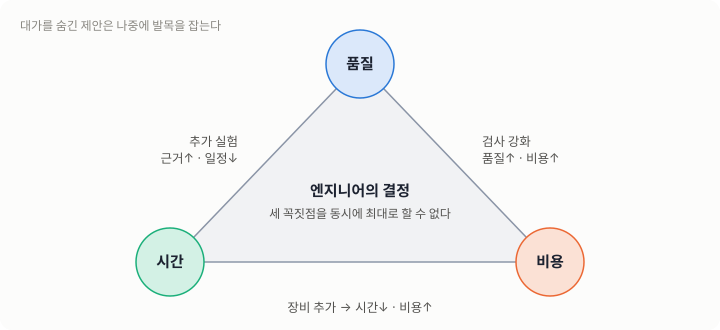
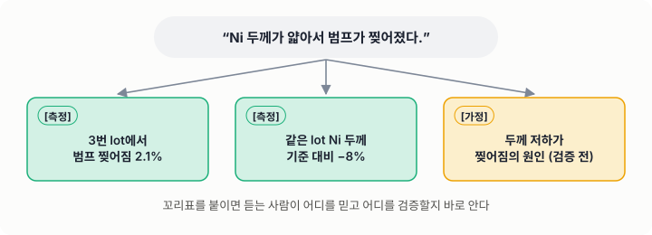
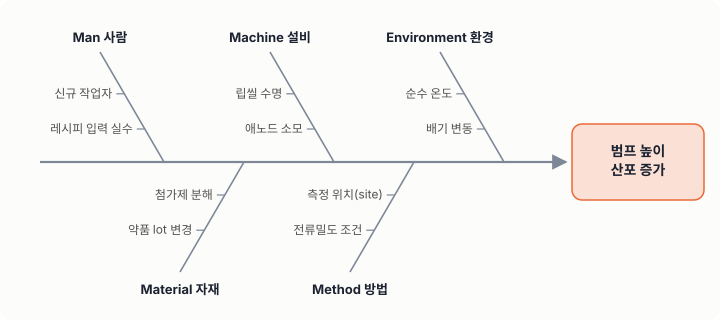
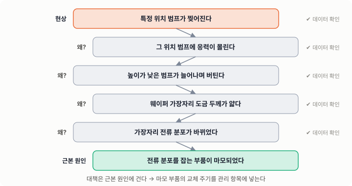

# 01. 엔지니어의 마인드

## 학습 목표

- 엔지니어의 일이 "정답 찾기"가 아니라 **제약 속의 의사결정**이라는 것을 이해한다.
- 현상, 해석, 가정을 구분해서 말하고 쓴다.
- 틀렸을 때 빨리, 명확하게 정정하는 것이 신뢰를 만든다는 것을 안다.

---

## 1. 엔지니어는 무엇으로 일하는가

과학자는 "왜 그런가"를 묻고, 엔지니어는 **"그래서 무엇을 바꿀 것인가"** 를 묻습니다.
엔지니어의 결과물은 결정이고, 그 결정에는 언제나 제약이 붙습니다.

| 제약 | 현장에서의 모습 |
|---|---|
| 시간 | 라인은 멈추지 않는다. 오늘 결정하지 않으면 내일 웨이퍼가 그대로 흘러간다. |
| 비용 | 테스트 웨이퍼, 계측 시간, 장비 다운타임이 모두 돈이다. |
| 정보 | 데이터는 언제나 부족하다. 완벽한 정보는 오지 않는다. |
| 위험 | 잘못된 결정은 수율 손실, 고객 클레임, 안전사고로 이어진다. |

그래서 좋은 엔지니어는 **"지금 가진 정보로 내릴 수 있는 가장 나은 결정 + 틀렸을 때 빨리 알아챌 장치"** 를 함께 만듭니다.



---

## 2. 열 가지 원칙

### 원칙 1. 현상과 해석을 분리하라

> "Ni 두께가 얇아서 범프가 찢어졌다."

이 문장에는 현상(찢어짐), 해석(원인은 Ni 두께), 가정(두께가 얇았을 것)이 섞여 있습니다. 나누어 쓰면 이렇게 됩니다.

- **[측정]** 3번 lot에서 범프 찢어짐이 2.1% 발생했다.
- **[측정]** 같은 lot의 Ni 두께 평균이 기준 대비 8% 낮았다.
- **[가정]** 두께 저하가 찢어짐의 원인이다. ← 아직 검증되지 않았다.



모든 숫자와 주장 앞에 **`[측정]`, `[계산]`, `[가정]`** 꼬리표를 붙이는 습관을 들이세요. 보고를 받는 사람이 어디를 믿고 어디를 의심해야 할지 바로 알 수 있습니다.

### 원칙 2. 단위와 자릿수를 먼저 보라

계산 결과가 나오면 공식보다 먼저 **단위가 맞는지, 자릿수가 상식적인지** 확인합니다.
도금 두께가 3 mm로 나왔다면 공식을 다시 볼 필요도 없이 어딘가 틀린 것입니다(µm 단위의 1000배).

### 원칙 3. 재현되지 않으면 아직 모르는 것이다

한 번 본 현상은 "관측"이고, 조건을 통제해서 다시 만들 수 있어야 "이해"입니다.
대책의 효과도 마찬가지로, 개선 전과 후를 같은 조건에서 비교해야 합니다.

### 원칙 4. 변화점을 먼저 찾아라

어제까지 괜찮던 것이 오늘 나쁘다면 **어제와 오늘 사이에 바뀐 것**이 있습니다.
4M(Man, Machine, Material, Method)과 1E(Environment)를 순서대로 확인하세요.
원인 분석의 80%는 변화점 추적으로 끝납니다.

### 원칙 5. 반증할 수 있는 가설을 세워라

"여러 요인이 복합적으로 작용했다"는 틀릴 수 없는 문장이라서 쓸모가 없습니다.
좋은 가설은 **"이 가설이 맞다면 X 조건에서 Y가 관측되어야 한다"** 처럼 검증 방법을 품고 있습니다.

### 원칙 6. 데이터로 말하되, 데이터의 출처를 의심하라

- 그 계측기는 교정되었는가?
- 표본은 전체를 대표하는가? (웨이퍼 중심만 쟀다든가)
- 평균만 보고 산포를 놓치지 않았는가?

### 원칙 7. 틀렸으면 빨리, 명확하게 정정하라

정정은 신뢰를 잃는 일이 아니라 **신뢰를 쌓는 일**입니다. 정정본에는 세 가지를 맨 앞에 적습니다.

1. 원래 무엇이라고 했는가
2. 무엇이 틀렸고, 왜 틀렸는가
3. 결론이 바뀌는가, 바뀌지 않는가

### 원칙 8. 트레이드오프를 숨기지 마라

모든 대책에는 대가가 있습니다. 전류밀도를 낮추면 품질은 좋아질 수 있지만 생산성(UPH)이 떨어집니다.
대가를 숨긴 제안은 나중에 반드시 발목을 잡습니다.

### 원칙 9. 안전은 협상 대상이 아니다

화학약품, 고전압, 회전체, 고온을 다루는 현장입니다. 일정 압박이 있어도 **안전 절차(보호구, LOTO, MSDS 확인)는 생략하지 않습니다.**

### 원칙 10. 기록이 곧 실력이다

기억은 사라지고 기록은 남습니다. 오늘 해결한 문제를 기록하지 않으면, 6개월 뒤 같은 문제를 처음부터 다시 풉니다.
**배운 것을 알고리즘으로 남기는 것**이 이 과정의 최종 목표입니다.

---

## 3. 생각의 도구

| 도구 | 언제 쓰는가 | 한 줄 사용법 |
|---|---|---|
| 5 Why | 근본 원인까지 내려갈 때 | "왜?"를 다섯 번 묻되, 각 답이 사실인지 확인한다 |
| 특성요인도(Fishbone) | 원인 후보를 빠짐없이 펼칠 때 | 4M1E를 가지로 놓고 후보를 붙인다 |
| 페르미 추정 | 데이터가 없을 때 크기를 가늠할 때 | 아는 값의 곱으로 자릿수를 맞춘다 |
| 최악의 경우 가정 | 위험을 판단할 때 | "이게 틀리면 무슨 일이 생기나?"를 먼저 묻는다 |
| 반대편 변호 | 결론을 내기 직전 | 내 결론을 반박하는 자료를 일부러 찾아본다 |





---

## 4. 나쁜 습관 vs 좋은 습관

| 나쁜 습관 | 좋은 습관 |
|---|---|
| "아마 ~ 때문일 겁니다" | "~가 원인이라면 ~가 보여야 합니다. 확인해 보겠습니다" |
| 결과를 다 모은 뒤에야 보고한다 | 중간에 "현재까지 / 다음 단계 / 막힌 것"을 짧게 공유한다 |
| 평균만 본다 | 평균, 산포, 분포 모양, 이상치를 함께 본다 |
| 한 가지 원인에 꽂힌다 | 원인 후보를 펼치고, 하나씩 제거한다 |
| 실수를 숨긴다 | 실수를 빨리 알리고, 재발 방지책을 함께 낸다 |
| 머릿속에만 있다 | 절차, 판단 기준, 사진을 문서로 남긴다 |

---

## 5. 문제 해결 기본 루프

```flow
# 엔지니어의 문제 해결 기본 루프
시작: 문제 인지 (알람, 불량, 문의)
1. 현상 정의 — 언제, 어디서, 얼마나, 무엇이
  > 측정값으로 적는다. "많이"가 아니라 "2.1%".
2. 영향 범위 확인 — 어느 lot, 장비, 제품까지인가
3. ? 즉시 격리가 필요한가
  예 → 해당 lot/장비 홀드 및 보고 → 4
  아니오 → 4
4. 변화점 조사 (4M1E)
5. 원인 가설 수립 (반증 가능한 형태로)
6. 검증 (데이터 재분석 또는 실험)
7. ? 가설이 검증되었는가
  아니오 → 5
  예 → 8
8. 대책 수립 및 효과 확인
9. 표준화 (레시피, 관리계획, 교육자료 반영)
끝: 기록 공유 및 종결
```

---

## 6. 자기 점검

1. "Ni 두께가 얇아서 찢어졌다"를 측정, 가정, 해석으로 나누어 다시 써 보세요.
2. 어제까지 정상이던 공정에서 오늘 이상이 생겼습니다. 가장 먼저 확인할 다섯 가지는 무엇인가요?
3. 내가 지난주에 보고한 내용 중 틀린 것을 발견했습니다. 정정 메일의 첫 세 줄을 써 보세요.
4. 지금 맡은 업무에서 "기록되지 않은 암묵지"를 하나 찾아 적어 보세요.
