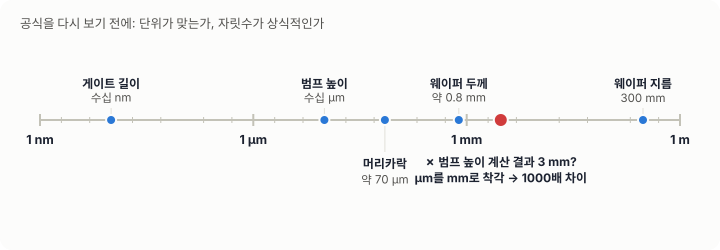
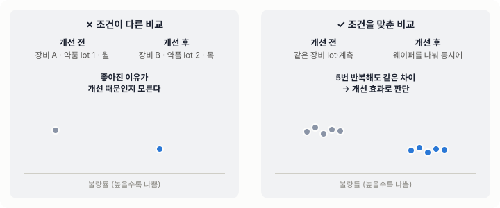
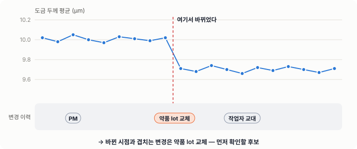
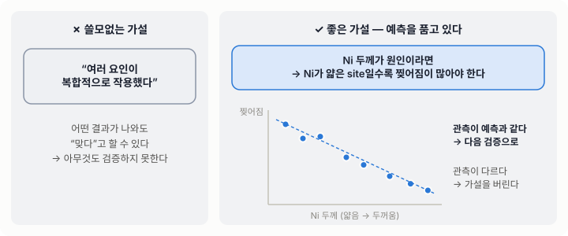
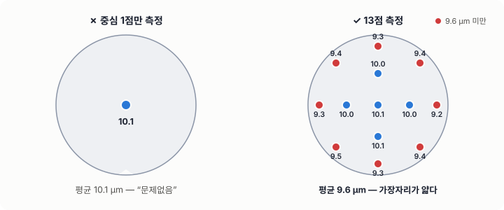
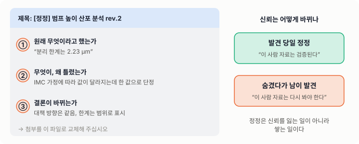
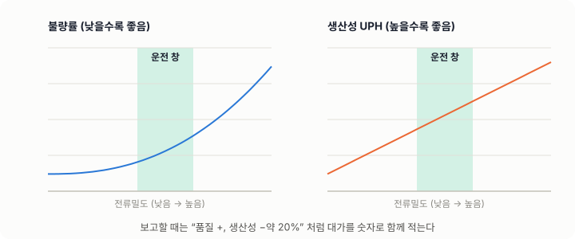
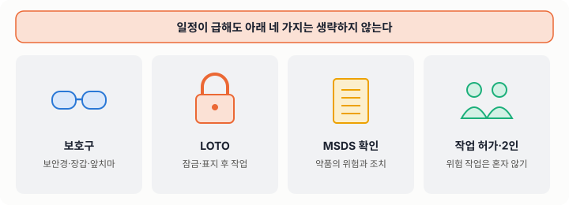
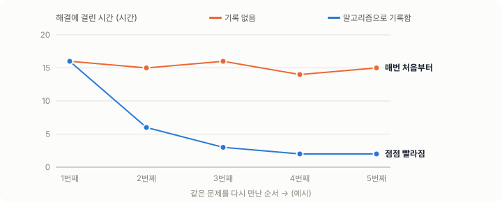

# 01. 엔지니어의 마인드

## 학습 목표

- 엔지니어의 일이 "정답 찾기"가 아니라 **제약 속의 의사결정**이라는 것을 이해한다.
- 현상, 해석, 가정을 구분해서 말하고 쓴다.
- 틀렸을 때 빨리, 명확하게 정정하는 것이 신뢰를 만든다는 것을 안다.

---

## 1. 엔지니어는 무엇으로 일하는가

과학자는 "왜 그런가"를 묻고, 엔지니어는 **"그래서 무엇을 바꿀 것인가"** 를 묻습니다.
엔지니어의 결과물은 결정이고, 그 결정에는 언제나 제약이 붙습니다.

| 제약 | 현장에서의 모습 |
|---|---|
| 시간 | 라인은 멈추지 않는다. 오늘 결정하지 않으면 내일 웨이퍼가 그대로 흘러간다. |
| 비용 | 테스트 웨이퍼, 계측 시간, 장비 다운타임이 모두 돈이다. |
| 정보 | 데이터는 언제나 부족하다. 완벽한 정보는 오지 않는다. |
| 위험 | 잘못된 결정은 수율 손실, 고객 클레임, 안전사고로 이어진다. |

그래서 좋은 엔지니어는 **"지금 가진 정보로 내릴 수 있는 가장 나은 결정 + 틀렸을 때 빨리 알아챌 장치"** 를 함께 만듭니다.


---

## 2. 열 가지 원칙

각 원칙은 **원칙 → 그림 → 현장 예시 → 이렇게 해 보기** 순서로 정리했습니다.

### 원칙 1. 현상과 해석을 분리하라

> "Ni 두께가 얇아서 범프가 찢어졌다."

이 문장에는 현상(찢어짐), 해석(원인은 Ni 두께), 가정(두께가 얇았을 것)이 섞여 있습니다. 나누어 쓰면 이렇게 됩니다.

- **[측정]** 3번 lot에서 범프 찢어짐이 2.1% 발생했다.
- **[측정]** 같은 lot의 Ni 두께 평균이 기준 대비 8% 낮았다.
- **[가정]** 두께 저하가 찢어짐의 원인이다. ← 아직 검증되지 않았다.


> **예시** — 회의에서 "약품이 문제인 것 같습니다"라고 말하는 대신
> "[측정] 약품 교체 후 두께가 0.3 µm 낮아졌습니다. [가정] 첨가제 농도 차이가 원인일 수 있어, 내일 분석 결과로 확인하겠습니다."라고 말합니다.
> 듣는 사람은 무엇이 확인된 사실이고 무엇을 기다려야 하는지 바로 압니다.

**이렇게 해 보기**: 모든 숫자와 주장 앞에 **`[측정]`, `[계산]`, `[가정]`** 꼬리표를 붙이세요.

### 원칙 2. 단위와 자릿수를 먼저 보라

계산 결과가 나오면 공식보다 먼저 **단위가 맞는지, 자릿수가 상식적인지** 확인합니다.



> **예시** — 도금 두께를 계산했더니 1 분에 22 µm가 나왔습니다. 경험상 구리는 1 ASD에서 1 분에 약 0.2 µm입니다.
> 다시 보니 전류밀도를 A/dm²(ASD) 그대로 A/m² 자리에 넣었습니다. 1 ASD = 100 A/m² 이므로 **100배** 차이가 났던 것입니다.

**이렇게 해 보기**: 계산하기 전에 "대략 이 정도일 것"이라는 예상값을 먼저 적고, 결과와 비교하세요. 10배 이상 다르면 단위부터 의심합니다.

### 원칙 3. 재현되지 않으면 아직 모르는 것이다

한 번 본 현상은 "관측"이고, 조건을 통제해서 다시 만들 수 있어야 "이해"입니다. 대책의 효과도 개선 전과 후를 **같은 조건**에서 비교해야 합니다.



> **예시** — 새 첨가제를 쓴 주에 불량률이 절반으로 줄었습니다. 그런데 같은 주에 장비 PM도 했고 약품 lot도 바뀌었습니다.
> 같은 장비에서 웨이퍼를 둘로 나눠 기존 첨가제와 새 첨가제로 동시에 진행하고, 3번 반복해서 같은 차이가 나는지 확인한 뒤에야 "첨가제 효과"라고 보고합니다.

**이렇게 해 보기**: 비교 실험을 계획할 때 "바꾸는 것 하나, 고정하는 것 전부"를 표로 적으세요.

### 원칙 4. 변화점을 먼저 찾아라

어제까지 괜찮던 것이 오늘 나쁘다면 **어제와 오늘 사이에 바뀐 것**이 있습니다. 4M(Man, Machine, Material, Method)과 1E(Environment)를 순서대로 확인하세요. 원인 분석의 상당수는 변화점 추적으로 끝납니다.



> **예시** — 두께 평균이 9일째부터 0.3 µm 낮아졌습니다. 같은 기간 변경 이력을 나란히 놓으니 9일째 아침에 약품 lot이 바뀌었습니다.
> PM(2일째)이나 작업자 교대(13일째)는 시점이 맞지 않으므로 후보에서 뒤로 미룹니다.

**이렇게 해 보기**: 추세 그래프 아래에 MES의 변경 이력(PM, lot 교체, 레시피 변경)을 같은 시간축으로 붙여 보세요.

### 원칙 5. 반증할 수 있는 가설을 세워라

"여러 요인이 복합적으로 작용했다"는 틀릴 수 없는 문장이라서 쓸모가 없습니다. 좋은 가설은 **"이 가설이 맞다면 X 조건에서 Y가 관측되어야 한다"** 처럼 검증 방법을 품고 있습니다.



> **예시** — "Ni 두께가 원인이라면, 같은 웨이퍼 안에서도 Ni가 얇은 site일수록 찢어짐이 많아야 한다."
> 이 예측은 site별 두께와 불량 위치를 겹쳐 보면 하루 만에 확인할 수 있습니다. 관계가 보이지 않으면 이 가설은 버리고 다음 후보로 갑니다.

**이렇게 해 보기**: 가설을 쓸 때 "이게 틀렸다면 무엇이 보일까?"를 한 줄 더 적으세요. 물리학자 파인만의 말처럼, 가장 속이기 쉬운 사람은 자기 자신입니다 ([Cargo Cult Science, 1974](https://calteches.library.caltech.edu/3043/)).

### 원칙 6. 데이터로 말하되, 데이터의 출처를 의심하라

- 그 계측기는 교정되었는가?
- 표본은 전체를 대표하는가? (웨이퍼 중심만 쟀다든가)
- 평균만 보고 산포를 놓치지 않았는가?



> **예시** — 중심 1점 계측값이 10.1 µm로 정상이라 출하했는데, 다음 공정에서 가장자리 범프 불량이 났습니다.
> 13점을 다시 재 보니 가장자리가 9.2~9.5 µm로 얇았습니다. "평균 정상"은 사실이었지만 **어디를 쟀는지**가 결론을 바꿨습니다.

**이렇게 해 보기**: 데이터를 받으면 숫자보다 먼저 "누가, 어떤 계측기로, 어디를, 몇 개" 쟀는지 확인하세요.

### 원칙 7. 틀렸으면 빨리, 명확하게 정정하라

정정은 신뢰를 잃는 일이 아니라 **신뢰를 쌓는 일**입니다. 정정본에는 세 가지를 맨 앞에 적습니다.

1. 원래 무엇이라고 했는가
2. 무엇이 틀렸고, 왜 틀렸는가
3. 결론이 바뀌는가, 바뀌지 않는가



> **예시** — 어제 보낸 분석에서 "한계값 2.23 µm"라고 단정했는데, 다시 계산해 보니 가정에 따라 값이 달라지는 범위였습니다.
> 오늘 아침 "[정정]" 메일로 ① 원래 주장 ② 틀린 이유 ③ 결론(대책 방향은 그대로, 한계는 범위로 표시)을 보내고 첨부를 교체했습니다.

**이렇게 해 보기**: 보낸 자료를 다음 날 한 번 더 "반대편 입장"에서 읽어 보세요. 고칠 곳이 보이면 그날 정정합니다.

### 원칙 8. 트레이드오프를 숨기지 마라

모든 대책에는 대가가 있습니다. 전류밀도를 낮추면 품질은 좋아질 수 있지만 생산성(UPH)이 떨어집니다. 대가를 숨긴 제안은 나중에 반드시 발목을 잡습니다.



> **예시** — "전류밀도를 낮추면 불량이 줄어듭니다"만 보고하면, 적용 후 생산 계획이 밀려 다시 되돌리게 됩니다.
> "불량 −40%, 대신 도금 시간 +25%로 장비당 처리량 −20%. 병목이 아닌 공정이라 일 생산량 영향은 없음"처럼 **대가와 그 영향**을 함께 적습니다.

**이렇게 해 보기**: 제안서마다 "얻는 것 / 잃는 것 / 잃는 것을 줄이는 방법" 세 칸을 만드세요.

### 원칙 9. 안전은 협상 대상이 아니다

화학약품, 고전압, 회전체, 고온을 다루는 현장입니다. 일정 압박이 있어도 **안전 절차는 생략하지 않습니다.**



> **예시** — 라인이 멈춰 급하게 펌프를 교체해야 하는 상황입니다. "잠깐이면 된다"며 전원을 잠그지 않고 작업하다 다른 사람이 전원을 넣으면 큰 사고가 납니다.
> 급할수록 LOTO(잠금·표지)를 하고, 다루는 약품의 MSDS에서 보호구와 응급조치를 확인한 뒤 시작합니다.

**이렇게 해 보기**: 처음 다루는 약품은 [안전보건공단 MSDS](https://msds.kosha.or.kr/)에서 검색해 위험 문구와 응급조치를 읽어 두세요. 에너지 차단 절차는 [OSHA LOTO 안내서](https://www.osha.gov/sites/default/files/publications/OSHA3120.pdf)가 잘 정리되어 있습니다.

### 원칙 10. 기록이 곧 실력이다

기억은 사라지고 기록은 남습니다. 오늘 해결한 문제를 기록하지 않으면, 6개월 뒤 같은 문제를 처음부터 다시 풉니다. **배운 것을 알고리즘으로 남기는 것**이 이 과정의 최종 목표입니다.



> **예시** — 반년 전에 해결한 "PM 후 두께 산포 증가"가 다시 생겼습니다. 그때 담당자는 다른 팀으로 갔고 남은 기록은 없습니다.
> 반대로 그때 판단 기준과 확인 순서를 알고리즘 맵으로 남겨 두었다면, 신입도 맵을 따라 1~2시간 안에 원인을 좁힐 수 있습니다.

**이렇게 해 보기**: 문제를 하나 해결할 때마다 "업무 알고리즘 맵"에 판단 기준과 사진을 붙여 남기세요 (→ 06 모듈).

---

## 3. 생각의 도구

| 도구 | 언제 쓰는가 | 한 줄 사용법 |
|---|---|---|
| 5 Why | 근본 원인까지 내려갈 때 | "왜?"를 다섯 번 묻되, 각 답이 사실인지 확인한다 |
| 특성요인도(Fishbone) | 원인 후보를 빠짐없이 펼칠 때 | 4M1E를 가지로 놓고 후보를 붙인다 |
| 페르미 추정 | 데이터가 없을 때 크기를 가늠할 때 | 아는 값의 곱으로 자릿수를 맞춘다 |
| 최악의 경우 가정 | 위험을 판단할 때 | "이게 틀리면 무슨 일이 생기나?"를 먼저 묻는다 |
| 반대편 변호 | 결론을 내기 직전 | 내 결론을 반박하는 자료를 일부러 찾아본다 |


---

## 4. 나쁜 습관 vs 좋은 습관

| 나쁜 습관 | 좋은 습관 |
|---|---|
| "아마 ~ 때문일 겁니다" | "~가 원인이라면 ~가 보여야 합니다. 확인해 보겠습니다" |
| 결과를 다 모은 뒤에야 보고한다 | 중간에 "현재까지 / 다음 단계 / 막힌 것"을 짧게 공유한다 |
| 평균만 본다 | 평균, 산포, 분포 모양, 이상치를 함께 본다 |
| 한 가지 원인에 꽂힌다 | 원인 후보를 펼치고, 하나씩 제거한다 |
| 실수를 숨긴다 | 실수를 빨리 알리고, 재발 방지책을 함께 낸다 |
| 머릿속에만 있다 | 절차, 판단 기준, 사진을 문서로 남긴다 |

---

## 5. 문제 해결 기본 루프

```flow
# 엔지니어의 문제 해결 기본 루프
시작: 문제 인지 (알람, 불량, 문의)
1. 현상 정의 — 언제, 어디서, 얼마나, 무엇이
  > 측정값으로 적는다. "많이"가 아니라 "2.1%".
2. 영향 범위 확인 — 어느 lot, 장비, 제품까지인가
3. ? 즉시 격리가 필요한가
  예 → 해당 lot/장비 홀드 및 보고 → 4
  아니오 → 4
4. 변화점 조사 (4M1E)
5. 원인 가설 수립 (반증 가능한 형태로)
6. 검증 (데이터 재분석 또는 실험)
7. ? 가설이 검증되었는가
  아니오 → 5
  예 → 8
8. 대책 수립 및 효과 확인
9. 표준화 (레시피, 관리계획, 교육자료 반영)
끝: 기록 공유 및 종결
```

---

## 6. 자기 점검

1. "Ni 두께가 얇아서 찢어졌다"를 측정, 가정, 해석으로 나누어 다시 써 보세요.
2. 어제까지 정상이던 공정에서 오늘 이상이 생겼습니다. 가장 먼저 확인할 다섯 가지는 무엇인가요?
3. 내가 지난주에 보고한 내용 중 틀린 것을 발견했습니다. 정정 메일의 첫 세 줄을 써 보세요.
4. 지금 맡은 업무에서 "기록되지 않은 암묵지"를 하나 찾아 적어 보세요.

---

## 더 보기

**읽을거리**
- [Richard Feynman, “Cargo Cult Science” (Caltech 졸업 연설, 1974)](https://calteches.library.caltech.edu/3043/)
- [Five whys — Wikipedia](https://en.wikipedia.org/wiki/Five_whys)
- [Ishikawa diagram (특성요인도) — Wikipedia](https://en.wikipedia.org/wiki/Ishikawa_diagram)

**안전**
- [안전보건공단 물질안전보건자료(MSDS) 검색](https://msds.kosha.or.kr/)
- [OSHA 3120 — Control of Hazardous Energy (Lockout/Tagout) 안내서 PDF](https://www.osha.gov/sites/default/files/publications/OSHA3120.pdf)

**책 (서점·도서관에서)**
- Henry Petroski, *To Engineer Is Human* — 실패에서 배우는 엔지니어링
- Barbara Minto, *The Pyramid Principle* — 결론 먼저 쓰는 보고서 구조
