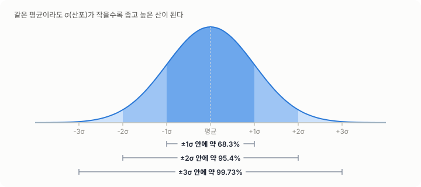
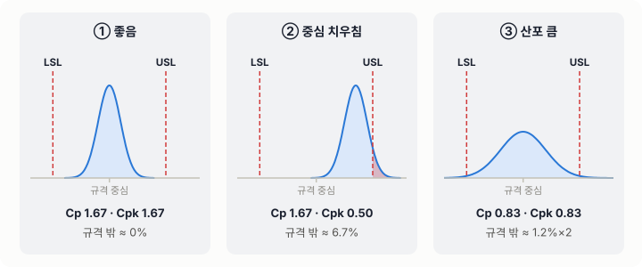
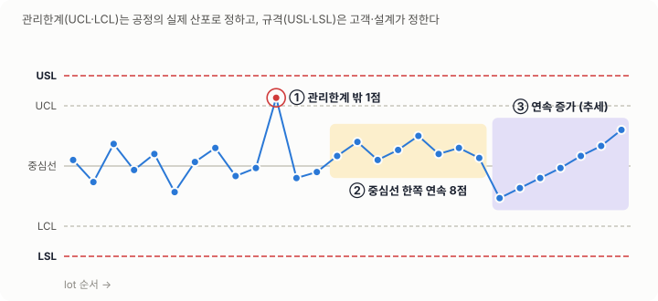
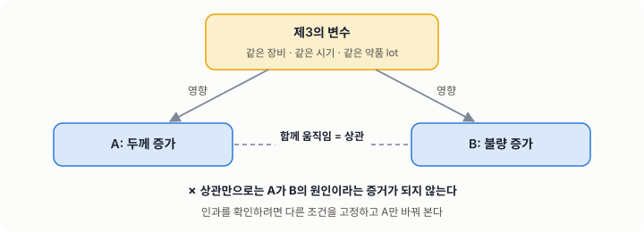
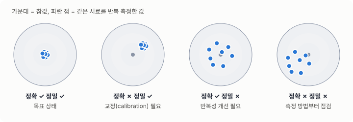
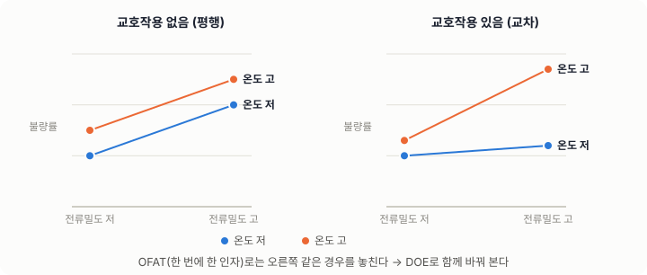
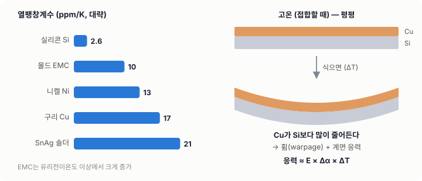
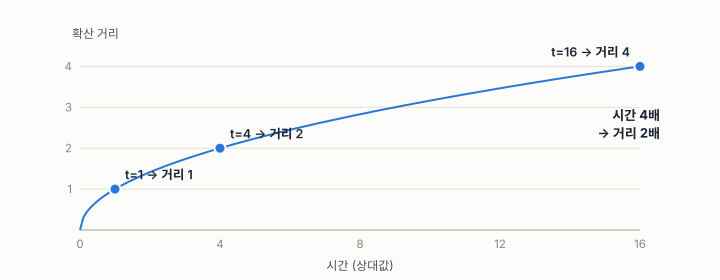
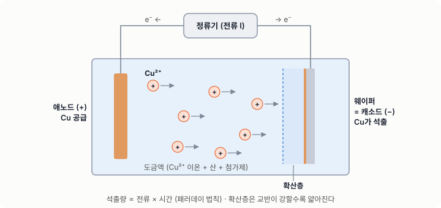

# 03. 공학의 기초

## 학습 목표

- 단위, 차원, 유효숫자로 계산의 상식선을 검증한다.
- 평균, 표준편차, 공정능력(Cp, Cpk), 관리도를 읽고 해석한다.
- 측정시스템과 실험계획법(DOE)의 기본을 이해한다.
- 응력, 열팽창, 확산, 전기화학의 기초 식을 현장 문제에 연결한다.

---

## 1. 단위와 차원 — 계산의 첫 번째 검사

### 차원 해석

식의 양변은 차원이 같아야 합니다. 차원이 맞지 않는 식은 틀린 식입니다.

- 전류밀도 `J = I / A` → [A] / [m²] = A/m²
- 도금 속도 `v = J · M / (n · F · ρ)` → (A/m² · g/mol) / (C/mol · g/m³) = m/s ✔

### 자주 쓰는 단위 변환

| 양 | 변환 |
|---|---|
| 길이 | 1 µm = 10⁻⁶ m = 1,000 nm = 10,000 Å |
| 전류밀도 | 1 A/dm² (ASD) = 100 A/m² = 10 mA/cm² |
| 압력 | 1 atm ≈ 101.3 kPa ≈ 760 Torr |
| 온도 | K = °C + 273.15 |
| 농도 | 1 g/L = 1,000 ppm (수용액, 근사) |

### 유효숫자

계측기 분해능이 0.1 µm인데 결과를 3.14159 µm로 쓰면 **모르는 것을 아는 척하는 것**입니다.
결과의 자릿수는 입력 중 가장 부정확한 값에 맞춥니다.

---

## 2. 통계 — 산포를 읽는 눈

### 평균과 표준편차

- 평균(x̄): 중심이 어디인가
- 표준편차(σ): 얼마나 퍼져 있는가
- **평균이 같아도 산포가 다르면 다른 공정입니다.**

정규분포에서는 다음 비율이 알려져 있습니다.

| 범위 | 포함 비율 |
|---|---|
| 평균 ± 1σ | 약 68.3% |
| 평균 ± 2σ | 약 95.4% |
| 평균 ± 3σ | 약 99.73% |



### 공정능력 지수

- `Cp = (USL − LSL) / 6σ` — 산포만 본다 (규격 폭 대비 산포가 얼마나 좁은가)
- `Cpk = min(USL − x̄, x̄ − LSL) / 3σ` — 중심 치우침까지 본다

| Cpk | 해석 |
|---|---|
| < 1.0 | 규격 이탈품이 상당히 나온다 → 즉시 개선 |
| 1.0 ~ 1.33 | 관리가 필요하다 |
| ≥ 1.33 | 양호 (일반적인 양산 목표) |
| ≥ 1.67 | 매우 양호 (중요 특성 목표로 자주 쓰임) |



**직접 해 보기** — 평균과 산포를 움직여 Cp, Cpk, 규격 밖 비율이 어떻게 변하는지 보세요.

<!-- widget:cpk -->

> **흔한 오해**: Cp가 높으면 좋은 공정이다? → 중심이 규격 끝에 붙어 있으면 Cp가 높아도 불량이 납니다. 항상 Cpk를 함께 보세요.

### 관리도 (Control Chart)

관리도는 **공정이 평소처럼 움직이는가**를 판단하는 도구입니다.
관리한계(UCL/LCL)는 공정의 실제 산포로 정하고, 규격(USL/LSL)은 고객이나 설계가 정합니다. **둘은 다른 개념입니다.**

이상 신호의 예 (Western Electric 규칙 일부)
1. 관리한계를 벗어난 점 1개
2. 중심선 한쪽에 연속 7~9점
3. 연속 6점 이상 증가 또는 감소 (추세)
4. 3점 중 2점이 2σ 밖 (같은 쪽)



**직접 해 보기** — 공정 상태를 골라 데이터를 만들고, 어떤 규칙에 걸리는지 확인하세요.

<!-- widget:control -->

### 상관과 인과

두 변수가 함께 움직인다고 해서 하나가 다른 하나의 원인은 아닙니다.


**제3의 변수**(예: 같은 장비, 같은 시기, 같은 약품 lot)가 둘 다에 영향을 줄 수 있습니다. 인과를 확인하려면 실험으로 한 인자만 바꿔 봐야 합니다.

### 표본

- 웨이퍼 한 장의 중심 한 점만 재면 웨이퍼 전체를 대표하지 못합니다.
- 측정 위치(site map), 웨이퍼 수, lot 수를 정하는 것이 데이터 품질의 절반입니다.

---

## 3. 측정 — 데이터를 믿기 전에

| 용어 | 뜻 |
|---|---|
| 정확도 (Accuracy) | 참값에 얼마나 가까운가 → 교정(calibration)으로 관리 |
| 정밀도 (Precision) | 반복하면 얼마나 같은 값이 나오는가 |
| 반복성 (Repeatability) | 같은 사람, 같은 장비로 반복 측정했을 때의 산포 |
| 재현성 (Reproducibility) | 다른 사람이나 다른 장비로 측정했을 때의 산포 |
| Gage R&R | 측정 산포가 공정 산포에서 차지하는 비율 |



> 측정 산포가 공정 산포의 30%를 넘으면, 그 계측으로는 공정 변화를 구분하기 어렵습니다. (일반적으로 10% 미만이면 양호, 10~30%는 조건부로 수용합니다.)

---

## 4. 실험계획법 (DOE) 기초

한 번에 한 인자씩 바꾸는 실험(OFAT)은 **교호작용**을 놓치고 웨이퍼를 많이 씁니다.

| 용어 | 뜻 | 예 |
|---|---|---|
| 인자 (Factor) | 바꾸는 변수 | 전류밀도, 온도, 첨가제 농도 |
| 수준 (Level) | 인자의 값 | 저 / 고 |
| 반응 (Response) | 측정하는 결과 | 두께 균일도, 조성, 불량률 |
| 주효과 | 한 인자가 반응에 주는 평균 영향 | |
| 교호작용 | 한 인자의 효과가 다른 인자 수준에 따라 달라짐 | 온도가 높을 때만 전류밀도 효과가 커짐 |
| 랜덤화 | 실험 순서를 무작위로 | 시간에 따른 드리프트를 분산 |
| 블록화 | 통제 못 하는 변수를 묶음 | 장비 A, B를 블록으로 |



### 좋은 DOE의 조건

1. **검증할 가정에 번호를 붙이고**, 각 실험 레그가 어느 가정을 검증하는지 표로 연결합니다.
2. **내가 바꿀 수 있는 인자**와 **다른 공정이 주관하는 인자**를 구분합니다.
3. 실험 전에 **판별 기준**을 먼저 적습니다. "A가 맞다면 반응이 X 이상 변해야 한다."

```flow
# DOE 설계 절차
시작: 검증할 질문 정의
1. 가설과 검증 가정 목록 작성 (A1, A2, ...)
2. 인자와 수준 선정
  > 바꿀 수 있는 인자와 주관 공정이 다른 인자를 구분한다.
3. 반응 변수와 측정 방법 확정
4. ? 측정시스템이 충분히 정밀한가
  아니오 → 계측 조건 개선 또는 대체 계측 → 3
  예 → 5
5. 판별 기준을 실험 전에 기록
6. 실험 배치 (랜덤화, 블록화, 반복 수)
7. 실행 및 데이터 수집
8. 분석 (주효과, 교호작용, 잔차 확인)
9. ? 판별 기준을 만족하는가
  아니오 → 가설 수정 → 1
  예 → 10
10. 확인 실험 (최적 조건 재현)
끝: 결론과 다음 단계 보고
```

---

## 5. 재료역학 기초 — 응력과 열팽창

### 응력과 변형

- 응력 `σ = F / A` (단위 Pa = N/m²)
- 변형률 `ε = ΔL / L` (단위 없음)
- 탄성 영역에서는 `σ = E · ε` (E: 탄성계수, 영률)

### 열팽창 불일치 (CTE mismatch)

서로 다른 재료를 붙여 놓고 온도를 바꾸면, 각자 늘어나려는 양이 달라서 계면에 응력이 생깁니다.

- 자유 열변형률 `ε = α · ΔT` (α: 열팽창계수, 1/K)
- 대략적인 열응력 `σ ≈ E · Δα · ΔT`

| 재료 | 열팽창계수 (대략, ppm/K) |
|---|---|
| 실리콘 | 약 2.6 |
| 구리 | 약 17 |
| 니켈 | 약 13 |
| 주석계 솔더 | 약 20~23 |
| 몰드 수지(EMC) | 약 7~15 (유리전이 이하), 그 이상에서 크게 증가 |

> 패키징 불량(휨, 박리, 범프 균열)의 상당수는 **CTE 불일치 + 온도 이력**으로 설명됩니다. 리플로우와 냉각, 신뢰성 열사이클을 거칠 때마다 응력이 반복됩니다.



**직접 해 보기** — 두 재료와 온도 변화를 골라 열변형 차이와 응력 크기를 가늠해 보세요.

<!-- widget:cte -->

---

## 6. 열·물질 전달 기초 — 확산

- 확산은 농도가 높은 곳에서 낮은 곳으로 물질이 이동하는 현상입니다.
- 픽의 제1법칙: `J = −D · dC/dx` (D: 확산계수)
- 확산 거리의 크기: `x ≈ √(D · t)` → **시간을 4배로 늘려야 거리가 2배**가 됩니다.
- 확산계수는 온도에 지수적으로 민감합니다 (아레니우스: `D = D₀ · exp(−Q / RT)`).



**직접 해 보기** — 시간과 온도를 바꿔 확산 거리가 어떻게 변하는지 보세요.

<!-- widget:diffusion -->

현장 연결
- 도금: 전극 표면 근처의 **확산층** 두께가 이온 공급 속도를 결정합니다. 교반이 강하면 확산층이 얇아집니다.
- 패키징: 고온 보관이나 리플로우 중 계면에서 금속간화합물(IMC)이 자라는 속도도 확산이 지배합니다.

---

## 7. 전기화학 기초 — 도금의 언어

### 패러데이 법칙

전기량만큼 금속이 석출됩니다.

- 석출 질량 `m = (I · t · M) / (n · F)` × 전류효율
  - I: 전류(A), t: 시간(s), M: 몰질량(g/mol), n: 이온 전하수, F: 패러데이 상수(약 96,485 C/mol)
- 두께로 바꾸면 `두께 = m / (ρ · A)`



**직접 해 보기** — 금속, 전류밀도, 시간, 전류효율을 넣으면 도금 두께를 계산합니다.

<!-- widget:faraday -->

### 핵심 개념

| 개념 | 뜻 | 현장 의미 |
|---|---|---|
| 전류밀도 | 단위 면적당 전류 | 높으면 빠르지만 거칠어지거나 조성이 바뀔 수 있다 |
| 전류효율 | 금속 석출에 쓰인 전류의 비율 | 나머지는 수소 발생 등 부반응에 쓰인다 |
| 한계전류밀도 | 확산이 공급을 따라가지 못하는 전류밀도 | 넘으면 이상 석출(분말, 탄 도금)이 생긴다 |
| 첨가제 | 촉진제, 억제제, 평탄제 | 표면 형상과 결정 조직을 조절한다 |
| 균일전착성 | 패턴 위치와 관계없이 고르게 도금되는 정도 | 웨이퍼 중심과 가장자리, 밀집 패턴과 고립 패턴의 차이 |

---

## 8. 모델링 마인드

> "모든 모델은 틀렸다. 그러나 일부는 쓸모 있다." — George Box

- 모델의 목적은 정답이 아니라 **의사결정에 필요한 정도의 예측**입니다.
- 모델 결과를 보고할 때는 **가정 목록**을 함께 내놓습니다.
- 모델이 실측과 다르면, 모델을 고치기 전에 **빠진 물리**가 있는지 먼저 봅니다. 예를 들어 언더필이 차지하는 면적을 빼먹으면 응력 결론이 뒤집힐 수 있습니다.
- 숫자 하나가 아니라 **범위(밴드)** 로 말하는 습관을 들이세요. 입력 가정이 바뀌면 결과도 바뀝니다.

---

## 자기 점검

1. 1 ASD는 몇 mA/cm²인가요?
2. 규격 10 ± 1 µm, 평균 10.4 µm, 표준편차 0.2 µm일 때 Cp와 Cpk를 계산해 보세요. (정답: Cp ≈ 1.67, Cpk = 1.0)
3. 관리한계와 규격의 차이를 신입에게 설명하듯 써 보세요.
4. 실리콘 위의 구리 패턴이 250 °C에서 상온으로 식을 때 응력이 생기는 이유를 CTE로 설명해 보세요.
5. 확산 시간이 9배가 되면 확산 거리는 몇 배가 되나요?

---

## 더 보기

**통계·공정능력·관리도 (무료 핸드북)**
- [NIST/SEMATECH e-Handbook of Statistical Methods — 전체 목차](https://www.itl.nist.gov/div898/handbook/stoc.htm)
- [NIST Handbook — Process Capability (공정능력)](https://www.itl.nist.gov/div898/handbook/pmc/section1/pmc16.htm)
- [NIST Handbook — What are Control Charts? (관리도)](https://www.itl.nist.gov/div898/handbook/pmc/section3/pmc31.htm)
- [NIST Handbook — What is experimental design? (실험계획법)](https://www.itl.nist.gov/div898/handbook/pri/section1/pri11.htm)
- [Western Electric rules (관리도 이상 판정 규칙) — Wikipedia](https://en.wikipedia.org/wiki/Western_Electric_rules)
- [Process capability index — Wikipedia](https://en.wikipedia.org/wiki/Process_capability_index)

**측정**
- [Measurement system analysis — Wikipedia](https://en.wikipedia.org/wiki/Measurement_system_analysis)
- [ANOVA gauge R&R — Wikipedia](https://en.wikipedia.org/wiki/ANOVA_gauge_R%26R)

**강의 (영상·슬라이드)**
- [MIT OCW 2.830J Control of Manufacturing Processes — SPC·DOE·Run-to-Run·수율 (강의 영상·슬라이드)](https://ocw.mit.edu/courses/2-830j-control-of-manufacturing-processes-sma-6303-spring-2008/)

**확산·전기화학**
- [Fick's laws of diffusion — Wikipedia](https://en.wikipedia.org/wiki/Fick%27s_laws_of_diffusion)
- [Faraday's laws of electrolysis — Wikipedia](https://en.wikipedia.org/wiki/Faraday%27s_laws_of_electrolysis)
- [Andricacos et al., “Damascene copper electroplating for chip interconnections”, IBM J. Res. Dev. 42(5), 1998](https://doi.org/10.1147/rd.425.0567)
- [“The chemistry of additives in damascene copper plating”, IBM J. Res. Dev. 49(1), 2005](https://doi.org/10.1147/rd.491.0003)

**책**
- D. C. Montgomery, *Introduction to Statistical Quality Control* — SPC·공정능력의 표준 교재
- M. Paunovic, M. Schlesinger, *Fundamentals of Electrochemical Deposition* — 전해도금 기초
