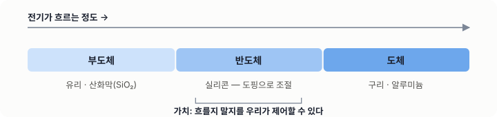
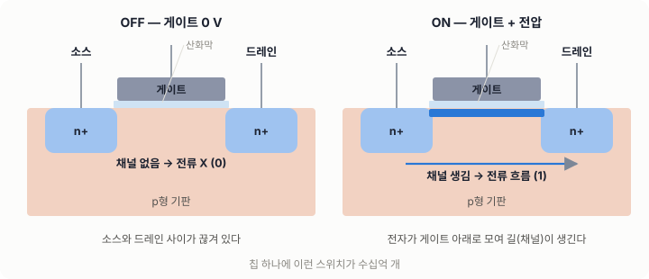
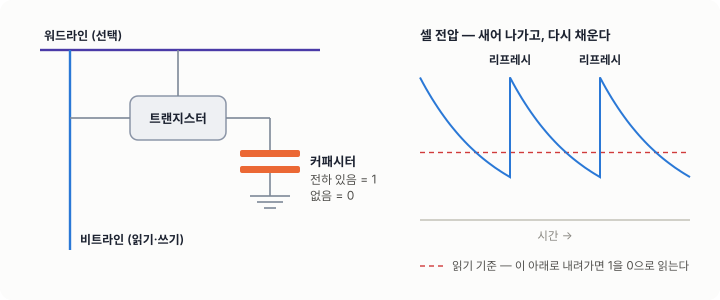
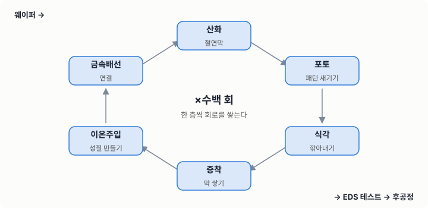
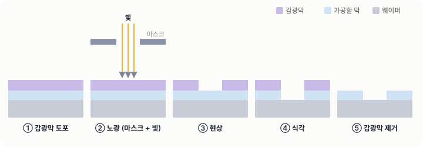
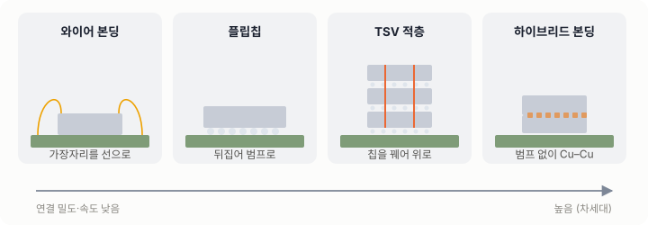
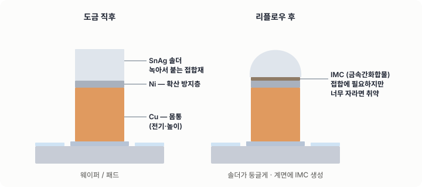
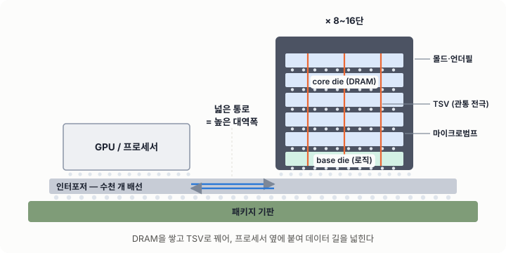
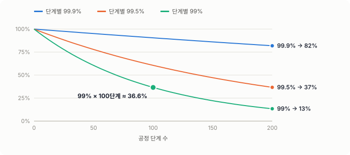

# 04. 반도체의 기초

## 학습 목표

- 반도체가 왜 "반"도체인지, 트랜지스터가 어떻게 스위치가 되는지 설명한다.
- DRAM과 NAND의 차이를 안다.
- 웨이퍼에서 칩, 칩에서 패키지까지의 전체 흐름을 그린다.
- HBM이 왜 필요하고 어떻게 쌓는지 설명한다.

---

## 1. 반도체란

| 구분 | 전기가 흐르는 정도 | 예 |
|---|---|---|
| 도체 | 잘 흐른다 | 구리, 알루미늄 |
| 부도체 | 흐르지 않는다 | 유리, 산화막(SiO₂) |
| 반도체 | **조건에 따라** 흐르게 할 수 있다 | 실리콘(Si), 게르마늄 |



반도체의 가치는 "전기가 흐를지 말지를 **우리가 제어할 수 있다**"는 데 있습니다.

### 도핑

순수한 실리콘에 불순물을 아주 조금 넣어 전기적 성질을 바꿉니다.

- **N형**: 인(P), 비소(As) 첨가 → 전자가 남는다 (음전하 운반)
- **P형**: 붕소(B) 첨가 → 정공이 생긴다 (양전하 운반)

### PN 접합

P형과 N형을 붙이면 한쪽 방향으로만 전류가 흐르는 **다이오드**가 됩니다. 이것이 모든 반도체 소자의 출발점입니다.

---

## 2. 트랜지스터 — 전기로 움직이는 스위치

MOSFET(금속-산화막-반도체 전계효과 트랜지스터)은 네 부분으로 되어 있습니다.

- **소스(Source)**, **드레인(Drain)**: 전류가 들어오고 나가는 곳
- **게이트(Gate)**: 스위치 손잡이
- **게이트 산화막**: 게이트와 채널을 전기적으로 분리하는 얇은 절연막



게이트에 전압을 걸면 아래에 **채널**이 생겨 소스와 드레인 사이에 전류가 흐릅니다(ON). 전압을 빼면 끊깁니다(OFF).
이 ON/OFF가 디지털의 1과 0입니다. 칩 하나에 이런 스위치가 수십억 개 들어 있습니다.

> 미세화의 의미: 트랜지스터를 작게 만들면 같은 면적에 더 많이 넣을 수 있고, 더 빠르고 전력도 적게 씁니다. 대신 누설전류, 공정 산포, 미세 결함에 훨씬 민감해집니다.

---

## 3. 메모리 반도체

| 구분 | DRAM | NAND 플래시 |
|---|---|---|
| 저장 원리 | 커패시터에 전하를 저장 | 절연층에 갇힌 전하로 저장 |
| 전원을 끄면 | 데이터가 사라진다 (휘발성) | 데이터가 남는다 (비휘발성) |
| 속도 | 빠르다 | 상대적으로 느리다 |
| 특징 | 전하가 새어 나가서 주기적으로 다시 써야 한다 (리프레시) | 3D로 수백 층을 쌓는다 |
| 용도 | 주기억장치, GPU 메모리(HBM) | SSD, 스마트폰 저장장치 |

**DRAM 셀** = 트랜지스터 1개 + 커패시터 1개 (1T1C)
- 커패시터에 전하가 있으면 1, 없으면 0입니다.
- 트랜지스터는 그 커패시터를 읽고 쓰는 문 역할을 합니다.



---

## 4. 반도체 제조의 전체 흐름

```flow
# 웨이퍼에서 고객까지
시작: 실리콘 잉곳 성장, 웨이퍼 절단
1. 전공정 (FAB) — 웨이퍼 위에 회로를 만든다
  > 산화, 포토, 식각, 증착, 이온주입, 금속배선을 수백 번 반복한다.
2. 웨이퍼 테스트 (EDS / Probe)
  > 웨이퍼 상태에서 칩 하나하나의 전기적 특성을 검사해 양품과 불량을 가린다.
3. 범프 형성 (Wafer-level packaging)
  > 칩을 외부와 연결할 금속 돌기를 도금으로 만든다.
4. 후면 공정 및 절단 (Dicing)
5. 패키징 — 적층, 접합, 몰딩
6. 최종 테스트 및 신뢰성 평가
7. ? 출하 기준을 만족하는가
  아니오 → 불량 분석 및 피드백 → 1
  예 → 8
8. 고객 실장 (SMT)
끝: 최종 제품 (서버, GPU, 스마트폰)
```

### 전공정 8대 공정 (요약)



| 공정 | 하는 일 | 비유 |
|---|---|---|
| 웨이퍼 제조 | 고순도 실리콘 원판을 만든다 | 도화지 |
| 산화 | 표면에 절연막(SiO₂)을 만든다 | 보호 코팅 |
| 포토 (노광) | 빛으로 회로 패턴을 감광막에 새긴다 | 사진 인화 |
| 식각 | 필요 없는 부분을 깎아낸다 | 조각 |
| 증착 | 얇은 막을 쌓는다 (CVD, PVD, ALD) | 덧칠 |
| 이온주입 | 불순물을 넣어 전기적 성질을 만든다 | 양념 |
| 금속배선 | 소자끼리 전선으로 연결한다 | 배선 공사 |
| EDS (테스트) | 칩마다 동작을 검사한다 | 검수 |



---

## 5. 패키징 — 칩을 세상과 연결하기

패키징이 하는 일은 네 가지입니다.
1. **전기 연결**: 칩의 신호와 전원을 기판으로 연결한다.
2. **보호**: 습기, 충격, 오염으로부터 칩을 지킨다.
3. **방열**: 칩에서 나는 열을 밖으로 내보낸다.
4. **실장 편의**: 고객이 기판에 붙일 수 있는 형태로 만든다.

### 연결 방식의 발전

| 방식 | 설명 | 특징 |
|---|---|---|
| 와이어 본딩 | 금선이나 구리선으로 칩 가장자리를 연결 | 저렴하다. 연결 수와 속도에 한계가 있다 |
| 플립칩 | 칩을 뒤집어 범프로 기판에 직접 접합 | 칩 면적 전체를 연결에 쓸 수 있다 |
| TSV | 실리콘을 수직으로 뚫어 칩끼리 연결 | 칩을 위로 쌓을 수 있다 |
| 하이브리드 본딩 | 범프 없이 구리끼리 직접 접합 | 초미세 피치. 차세대 기술 |



### 범프 (Bump)

칩의 패드 위에 도금으로 만드는 작은 금속 기둥입니다. 일반적으로 이렇게 쌓습니다.

- **구리(Cu)**: 몸통. 전기가 잘 통하고 높이를 만든다.
- **니켈(Ni)**: 확산 방지층. 솔더와 구리가 과도하게 반응하는 것을 막는다.
- **솔더(예: SnAg)**: 접합재. 녹아서 상대 범프나 패드와 붙는다.



접합 후에는 솔더와 금속 사이에 **금속간화합물(IMC)** 이 생깁니다. IMC는 접합에 꼭 필요하지만, 너무 자라면 부서지기 쉽고 부피 변화로 void를 만들 수 있습니다.

---

## 6. HBM (High Bandwidth Memory)

### 왜 필요한가

AI와 GPU 연산은 **메모리에서 데이터를 꺼내 오는 속도(대역폭)** 에 막힙니다.
HBM은 DRAM 칩을 수직으로 쌓고 수천 개의 통로로 프로세서와 연결해서 대역폭을 크게 넓힙니다.

[▶ HBM 역추적 탭에서 보기](#go-hbm) — AI 데이터센터에서 시작해 서버, CoWoS 실장, 출하, 스택 웨이퍼, 적층, 후면·앞면 범프, DRAM 셀까지 약 1억 배를 스크롤로 줌인하며 거꾸로 따라갑니다.

### 구조



### 핵심 공정 기술

| 기술 | 내용 |
|---|---|
| TSV | 칩을 관통하는 수직 전극. 칩 사이 신호와 전원의 통로 |
| 마이크로범프 | 수십 µm 피치의 미세 범프. 도금으로 만든다 |
| 웨이퍼 박화 | 쌓기 위해 웨이퍼를 수십 µm 수준으로 얇게 간다 |
| 적층 및 접합 | 칩을 정렬해 쌓고 열과 압력으로 접합한다 |
| 언더필, 몰딩 | 범프 사이 빈 공간을 채워 기계적으로 보강하고 보호한다 |

### HBM에서 자주 문제가 되는 것

- **휨(warpage)**: 얇은 칩과 서로 다른 CTE 때문에 휜다. 접합 불량의 원인이 된다.
- **범프 높이 산포(coplanarity)**: 범프 높이가 고르지 않으면 일부 범프가 덜 붙거나 응력을 몰아서 받는다.
- **범프 균열과 계면 박리**: 열 이력에 따른 응력이 반복되면서 생긴다.
- **열**: 층이 많을수록 열이 빠져나가기 어렵다.

> 단수가 늘어날수록 **같은 공정 산포가 더 큰 위험이 됩니다.** 한 층의 불량이 전체 스택의 불량이 되기 때문입니다. (스택 수율 ≈ 층별 수율의 거듭제곱)

---

## 7. 수율 (Yield)

- 수율 = 양품 수 / 전체 수
- 공정 단계별 수율을 곱한 것이 최종 수율입니다. 단계마다 99%여도 100단계를 지나면 약 37%만 남습니다 (0.99¹⁰⁰ ≈ 0.366).
- 그래서 반도체 공장은 **0.1%의 개선**에도 큰 노력을 들입니다.



**직접 해 보기** — 층별 수율과 적층 단수를 바꿔 스택 수율을 계산해 보세요.

<!-- widget:yield -->

---

## 8. 클린룸

- 미세 입자 하나가 회로를 끊거나 이어 버릴 수 있습니다.
- 클린룸 등급은 단위 부피당 입자 수로 나눕니다.
- 방진복, 에어샤워, 반입 물품 제한은 **수율을 지키는 규칙**입니다. 귀찮은 절차가 아닙니다.

---

## 자기 점검

1. DRAM이 리프레시를 해야 하는 이유를 한 문장으로 설명해 보세요.
2. 범프의 Ni 층은 왜 필요한가요?
3. HBM에서 단수가 늘어나면 왜 공정 산포에 더 민감해지나요?
4. 층별 수율이 99.5%인 12단 스택의 스택 수율은 대략 얼마인가요? (정답: 0.995¹² ≈ 94%)
5. 내 공정은 "웨이퍼에서 고객까지" 흐름도의 어느 단계에 있나요? 앞뒤 공정은 무엇인가요?

---

## 더 보기

**쉽게 읽는 글 (한국어)**
- [삼성전자 반도체 뉴스룸 — 반도체 백과사전: 반도체 8대 공정 한 눈에 보기](https://news.samsungsemiconductor.com/kr/%EB%B0%98%EB%8F%84%EC%B2%B4-%EB%B0%B1%EA%B3%BC%EC%82%AC%EC%A0%84-%EB%B0%98%EB%8F%84%EC%B2%B4-8%EB%8C%80-%EA%B3%B5%EC%A0%95-%ED%95%9C-%EB%88%88%EC%97%90-%EB%B3%B4%EA%B8%B0/)
- [삼성전자 반도체 뉴스룸 — 8대 공정 연재 모음](https://news.samsungsemiconductor.com/kr/category/%EA%B8%B0%EC%88%A0/8%EB%8C%80-%EA%B3%B5%EC%A0%95/)
- [삼성전자 반도체 — 반도체 8대 공정 8탄, EDS 공정](https://semiconductor.samsung.com/kr/support/tools-resources/fabrication-process/eight-essential-semiconductor-fabrication-processes-part-8-eds-electrical-die-sorting-for-the-perfect-chips/)
- [삼성전자 반도체 뉴스룸 — ‘패키징’ 태그 글 모음](https://news.samsungsemiconductor.com/kr/tag/%ED%8C%A8%ED%82%A4%EC%A7%95/)
- [SK하이닉스 뉴스룸 — 차세대 반도체 경쟁력의 핵심 ‘패키징’ 기술](https://news.skhynix.co.kr/next-generation-semiconductor/)
- [SK하이닉스 뉴스룸 — HBM 패키징 인터뷰 (TSV, MR-MUF)](https://news.skhynix.co.kr/hbm_pakage_interview_2024/)

**영상**
- [YouTube — ‘삼성전자’가 참 쉽게 알려주는 ‘반도체 8대공정’](https://www.youtube.com/watch?v=M2b2kpJRHmM)
- [YouTube 재생목록 — 전문가가 알려주는 반도체 8대공정](https://www.youtube.com/playlist?list=PL74m3He-VakbZ3YnaYg2bGFwwQkWj-YPl)
- [YouTube — Branch Education, “How are Microchips Made?” (3D 애니메이션, 영어)](https://www.youtube.com/watch?v=dX9CGRZwD-w)
- [YouTube — SK하이닉스 공식 채널](https://www.youtube.com/@SKhynix)

**강의**
- [MIT OCW 6.152J Micro/Nano Processing Technology — 산화·포토·증착 등 공정 기초](https://ocw.mit.edu/courses/6-152j-micro-nano-processing-technology-fall-2005/)

**HBM·패키징 더 깊이**
- [Semiconductor Engineering — High-Bandwidth Memory 지식 센터 (영어)](https://semiengineering.com/knowledge_centers/memory/volatile-memory/high-bandwidth-memory/)
- [JEDEC — HBM3 표준(JESD238) 발표 자료](https://www.jedec.org/news/pressreleases/jedec-publishes-hbm3-update-high-bandwidth-memory-hbm-standard)
- [High Bandwidth Memory — Wikipedia](https://en.wikipedia.org/wiki/High_Bandwidth_Memory)
- [Through-silicon via — Wikipedia](https://en.wikipedia.org/wiki/Through-silicon_via)
- [“Intermetallic compounds in 3D integrated circuits technology: a brief review” (오픈 액세스)](https://www.ncbi.nlm.nih.gov/pmc/articles/PMC5642821/)

**책**
- J. D. Plummer, M. D. Deal, P. B. Griffin, *Silicon VLSI Technology* — 전공정 교과서
