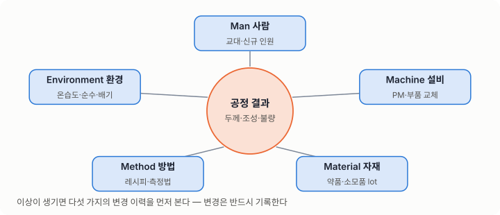
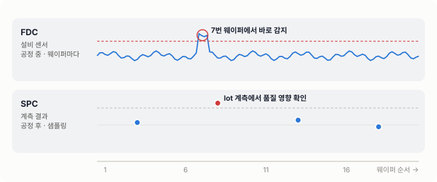
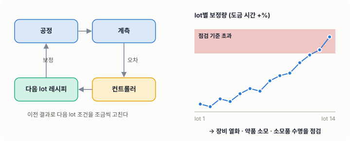
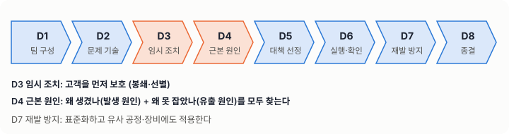
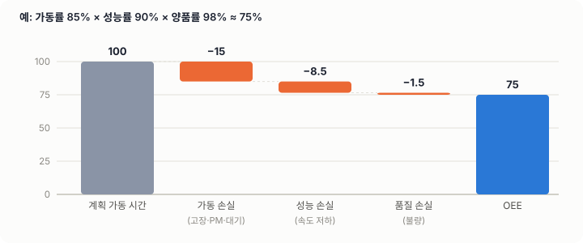
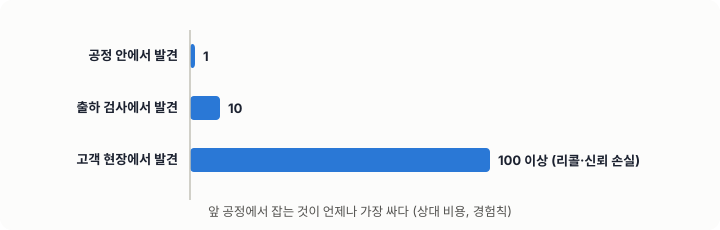
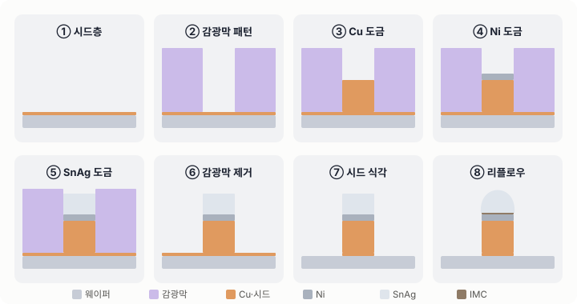
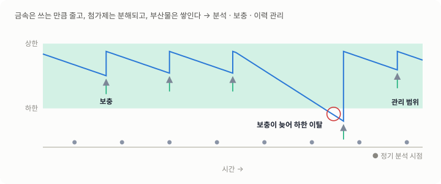

# 05. 제조기술의 기초

## 학습 목표

- 양산 공장이 "같은 것을 매일 똑같이" 만들기 위해 쓰는 체계를 이해한다.
- 4M1E, SPC, FDC, 변경관리, FMEA, 8D의 목적과 쓰임을 안다.
- 설비 관리(PM, OEE)와 품질 비용의 개념을 안다.
- 전해도금 공정을 예로 공정 관리 포인트를 읽는다.

---

## 1. 양산이란 무엇인가

연구실에서는 **한 번 잘 만들면** 성공입니다. 양산에서는 **매일, 모든 장비에서, 모든 사람이 똑같이** 만들어야 성공입니다.
양산 기술은 결국 **산포와의 싸움**입니다.

### 공장의 구성 요소

| 요소 | 역할 |
|---|---|
| 설비 (Equipment) | 공정을 실제로 수행한다 |
| 레시피 (Recipe) | 설비가 따르는 공정 조건의 집합 |
| MES | lot의 흐름, 이력, 홀드를 관리하는 생산 관리 시스템 |
| SPC | 공정 결과(계측값)의 통계적 관리 |
| FDC | 설비 센서 데이터의 실시간 이상 감지 |
| 표준 (SOP, 관리계획) | 사람이 따르는 절차와 기준 |

---

## 2. 4M 1E — 변화의 다섯 근원

| 구분 | 예 | 확인 질문 |
|---|---|---|
| Man (사람) | 작업자 교대, 신규 인원 | 작업 방법이 표준과 같은가? |
| Machine (설비) | PM, 부품 교체, 소프트웨어 업데이트 | 설비 상태가 변하지 않았는가? |
| Material (자재) | 약품 lot, 웨이퍼 공급사, 소모품 | 자재 lot이 바뀌지 않았는가? |
| Method (방법) | 레시피, 측정 방법, 공정 순서 | 조건이나 절차가 변경되지 않았는가? |
| Environment (환경) | 온습도, 진동, 배기, 순수 품질 | 유틸리티에 이상이 없는가? |



> 이상이 생기면 4M1E의 **변화 이력**을 가장 먼저 봅니다. 변경은 반드시 기록되어야 하는 이유이기도 합니다.

---

## 3. SPC와 FDC

| 구분 | SPC | FDC |
|---|---|---|
| 보는 것 | 공정 **결과** (두께, CD, 조성) | 설비 **상태** (전류, 전압, 온도, 유량, 압력) |
| 시점 | 공정 후 계측 | 공정 중 실시간 |
| 장점 | 제품 품질과 직접 연결된다 | 이상을 빨리, 웨이퍼마다 잡는다 |
| 한계 | 계측 샘플링 사이를 놓친다 | 센서 값이 품질과 항상 연결되지는 않는다 |

**둘을 함께 쓰는 것**이 핵심입니다. FDC로 빨리 잡고, SPC로 품질 영향을 확인합니다.



### Run-to-Run (R2R) 제어

이전 결과를 보고 다음 lot의 조건을 자동으로 미세 보정합니다.
예를 들어 도금 두께가 조금씩 낮아지는 추세라면 도금 시간을 약간 늘립니다.
단, **보정량이 계속 커지면 근본 원인(장비 열화, 약품 소모)을 찾아야 합니다.** 보정은 문제를 가릴 수도 있습니다.



---

## 4. 변경관리 (Change Control)

양산 중인 공정을 바꾸는 것은 **새로운 위험을 들여오는 일**입니다.

```flow
# 공정 변경 관리 절차
시작: 변경 필요 발생 (개선, 원가, 단종 대응)
1. 변경 내용과 목적 정의 (4M 중 무엇을 바꾸는가)
2. 위험 평가 (FMEA 갱신)
3. 평가 계획 수립 — 품질, 신뢰성, 재현성
4. 평가 실행 (복수 lot, 복수 장비)
5. ? 판정 기준을 만족하는가
  아니오 → 원인 분석 및 계획 수정 → 3
  예 → 6
6. 변경 심의 (유관 부서, 필요 시 고객 승인)
7. ? 승인되었는가
  아니오 → 보완 요청 사항 반영 → 3
  예 → 8
8. 표준, 레시피, 관리계획 개정
9. 적용 및 초기 유동 관리 (강화 모니터링)
끝: 변경 종결 및 기록 보관
```

---

## 5. FMEA — 일어나기 전에 막기

**고장모드 영향 분석 (Failure Mode and Effects Analysis)**

| 항목 | 질문 |
|---|---|
| 고장 모드 | 어떻게 잘못될 수 있는가? (예: 도금 두께 부족) |
| 영향 | 잘못되면 무슨 일이 생기는가? (예: 접합 불량, 신뢰성 저하) |
| 원인 | 왜 그렇게 되는가? (예: 전극 접촉 불량, 약품 농도 저하) |
| 현재 관리 | 지금 무엇으로 막거나 잡고 있는가? |
| S / O / D | 심각도, 발생도, 검출도 (각 1~10) |

- 전통적으로는 `RPN = S × O × D`로 우선순위를 정했습니다. 최근에는 **심각도가 높은 항목을 먼저** 보는 방식(AP, Action Priority)을 많이 씁니다.
- FMEA는 한 번 쓰고 끝나는 문서가 아닙니다. **불량이 나올 때마다 갱신하는 살아 있는 문서**입니다.

---

## 6. 8D — 문제 해결의 표준 양식

고객 클레임이나 중대 불량에 쓰는 표준 절차입니다.



| 단계 | 내용 |
|---|---|
| D1 | 팀 구성 |
| D2 | 문제 기술 (5W2H) |
| D3 | 임시 조치 (고객 보호, 봉쇄) |
| D4 | 근본 원인 규명 — **발생 원인**과 **유출 원인**(왜 못 잡았나)을 모두 |
| D5 | 영구 대책 선정 |
| D6 | 영구 대책 실행 및 효과 확인 |
| D7 | 재발 방지 (표준화, 유사 공정 전개) |
| D8 | 팀 격려 및 종결 |

> 흔한 실수: D4에서 발생 원인만 찾고 **유출 원인**을 빠뜨리는 것. "왜 생겼나"와 함께 "왜 검사에서 못 걸렀나"도 답해야 합니다.

---

## 7. 관리계획 (Control Plan)

공정별로 **무엇을, 얼마나 자주, 어떤 기준으로, 이탈하면 어떻게** 관리하는지 적은 문서입니다.

| 공정 | 관리 항목 | 규격 | 측정 방법 | 빈도 | 이탈 시 조치 |
|---|---|---|---|---|---|
| 도금 | 두께 | (제품별) | 계측기 A | lot당 n매 | 홀드 후 엔지니어 판정 |
| 도금 | 약품 농도 | (약품별) | 적정 분석 | 일 n회 | 보충 후 재분석 |

신입이 맡은 공정의 관리계획을 **처음부터 끝까지 한 번 읽는 것**은 가장 효과적인 공정 공부입니다.

---

## 8. 설비 관리

### PM (Preventive Maintenance, 예방정비)

- 고장 나기 전에 정해진 주기로 점검하고 부품을 교체합니다.
- PM 뒤에는 **Qual(장비 적격성 확인)** 을 통과해야 생산에 투입합니다.
- 소모품(씰, 전극, 필터, 멤브레인)의 수명 관리가 산포 관리의 핵심입니다.

### OEE (설비 종합 효율)

`OEE = 가동률 × 성능률 × 양품률`



| 손실 | 예 |
|---|---|
| 가동 손실 | 고장, PM, 셋업, 대기 |
| 성능 손실 | 속도 저하, 짧은 정지 |
| 품질 손실 | 불량, 재작업 |

---

## 9. 품질 비용과 1:10:100 법칙

불량을 발견하는 시점이 늦을수록 비용이 대략 10배씩 커진다는 경험칙입니다.



| 발견 시점 | 상대 비용 |
|---|---|
| 공정 내 | 1 |
| 후공정, 출하 검사 | 10 |
| 고객 현장 | 100 이상 (리콜, 신뢰 손실) |

그래서 **앞 공정에서 잡는 것**이 언제나 가장 쌉니다.

---

## 10. 예시 — 전해도금(ECD) 공정의 관리 포인트

웨이퍼 레벨 범프 도금을 예로 공정 관리의 관점을 정리했습니다. (일반적인 수준의 설명이며 특정 회사의 조건이 아닙니다.)

[▶ 범프 공정 탭에서 보기](#go-bump) — PVD Ti/Cu부터 스크러버 세정까지 12단계를 웨이퍼·다이·범프 세 단위로 한 화면에서 따라갑니다 (발표 모드 지원).

### 공정 흐름



```flow
# 웨이퍼 레벨 범프 도금 공정 개요
시작: 시드층 증착된 웨이퍼 입고
1. 포토레지스트 도포 및 패턴 형성
  > 범프가 생길 자리만 열린 틀(몰드)을 만든다.
2. 전처리 (세정, 젖음성 확보)
3. Cu 도금
4. Ni 도금 (확산 방지층)
5. 솔더 도금 (예: SnAg)
6. 레지스트 제거 (Strip)
7. 시드층 식각
8. 리플로우 (솔더를 녹여 둥글게 만듦)
9. 계측 — 높이, 형상, 조성, 외관
10. ? 기준을 만족하는가
  아니오 → 홀드 및 원인 분석
  예 → 11
11. 다음 공정 (적층, 패키징)으로 이동
끝: 범프 완성
```

### 관리 포인트

| 구분 | 관리 항목 | 왜 중요한가 |
|---|---|---|
| 약품 | 금속이온 농도, 산 농도, 첨가제 농도, 불순물 | 두께, 조성, 표면 형상이 바뀐다 |
| 전기 | 전류밀도, 파형, 접촉 저항 | 두께와 균일도, 조성이 바뀐다 |
| 유동 | 교반, 순환 유량, 온도 | 확산층 두께가 공급 속도와 조성을 정한다 |
| 하드웨어 | 립씰(전극 접촉부 밀봉), 애노드, 멤브레인, 필터 | 누액, 오염, 균일도 이상의 원인이 된다 |
| 결과 | 높이, 높이 산포, 조성, void, 외관 | 다음 공정의 접합 품질로 이어진다 |

> 도금은 **약품 상태가 매일 변하는 공정**입니다. 금속은 쓰는 만큼 줄고, 첨가제는 분해되고, 부산물은 쌓입니다. 정기 분석과 보충(dosing), 그리고 그 이력 관리가 안정성의 핵심입니다.



---

## 자기 점검

1. SPC와 FDC의 차이를 한 문장씩 설명해 보세요.
2. Run-to-Run 보정량이 매주 커지고 있습니다. 무엇을 의심해야 하나요?
3. 8D의 D4에서 반드시 함께 찾아야 하는 두 가지 원인은 무엇인가요?
4. 내 공정의 관리계획에서 이탈 시 조치가 "엔지니어 판정"인 항목을 하나 골라, 판정 절차를 알고리즘 맵으로 그려 보세요.
5. 도금 공정에서 약품 lot이 바뀐 뒤 두께 산포가 커졌습니다. 4M1E 중 무엇에 해당하고, 무엇을 확인해야 하나요?

---

## 더 보기

**품질 도구**
- [Eight disciplines problem solving (8D) — Wikipedia](https://en.wikipedia.org/wiki/Eight_disciplines_problem_solving)
- [Failure mode and effects analysis (FMEA) — Wikipedia](https://en.wikipedia.org/wiki/Failure_mode_and_effects_analysis)
- [NIST Handbook — What are Control Charts? (관리도)](https://www.itl.nist.gov/div898/handbook/pmc/section3/pmc31.htm)
- [Western Electric rules (관리도 이상 판정 규칙) — Wikipedia](https://en.wikipedia.org/wiki/Western_Electric_rules)

**강의**
- [MIT OCW 2.830J Control of Manufacturing Processes — SPC·DOE·Run-to-Run·수율 (강의 영상·슬라이드)](https://ocw.mit.edu/courses/2-830j-control-of-manufacturing-processes-sma-6303-spring-2008/)

**신뢰성·패키징 (논문·표준)**
- [JEDEC 표준 검색 — JESD22-A104 온도 사이클 시험](https://www.jedec.org/document_search?search_api_views_fulltext=jesd22a104)
- [“Intermetallic compounds in 3D integrated circuits technology: a brief review” (오픈 액세스)](https://www.ncbi.nlm.nih.gov/pmc/articles/PMC5642821/)
- [“Growth behavior of Ni-Sn intermetallic compounds in microbumps during long-term aging”, Materials Letters](https://www.sciencedirect.com/science/article/abs/pii/S0167577X22000969)
- [“Growth behavior and morphology of sidewall IMCs in Cu/Ni/Sn-Ag microbumps during multiple reflows”, Materials Letters](https://www.sciencedirect.com/science/article/abs/pii/S0167577X2201240X)
- [Andricacos et al., “Damascene copper electroplating for chip interconnections”, IBM J. Res. Dev. 42(5), 1998](https://doi.org/10.1147/rd.425.0567)

**더 찾아보기 (검색 링크)**
- [Google Scholar 검색 — SnAg 마이크로범프 전해도금](https://scholar.google.com/scholar?q=SnAg+electroplating+microbump)
- [Google Scholar 검색 — HBM 휨(warpage)과 마이크로범프 신뢰성](https://scholar.google.com/scholar?q=HBM+warpage+microbump+reliability)
- [Google Scholar 검색 — Ni3Sn4 IMC와 마이크로범프 void](https://scholar.google.com/scholar?q=Ni3Sn4+intermetallic+microbump+void)
