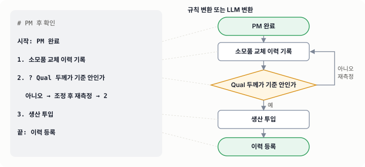

# 06. 업무 알고리즘 작성법

## 학습 목표

- 배운 업무를 **단계와 판단 지점**으로 나누어 적는다.
- 흐름 문법(flow)으로 쓰거나 LLM 변환을 써서 업무 알고리즘 맵을 만든다.
- 각 단계(노드)에 **종류 · 제목 · 글 · 사진**만 간단히 넣어 **다른 사람이 따라 할 수 있는 교재**로 만든다.

---

## 1. 왜 알고리즘으로 남기는가

선배의 노하우는 대부분 **판단 기준**에 있습니다. "이 정도면 괜찮다", "이럴 땐 장비부터 본다" 같은 기준입니다.
문장으로 된 인수인계서는 이 판단 지점이 묻히지만, 흐름도는 **마름모(판단)** 로 드러냅니다.


좋은 업무 알고리즘의 조건은 다음과 같습니다.
1. 처음 보는 사람이 **그대로 따라 할 수 있다**.
2. 판단 지점마다 **기준이 숫자나 관찰 가능한 사실**로 적혀 있다.
3. 단계마다 **왜 하는지**와 **주의점**이 글로 붙어 있고, 필요하면 사진이 있다.
4. 막다른 길이 없다. 모든 분기가 어디론가 이어지거나 명확히 끝난다.

---

## 2. 작성 순서

```flow
# 업무 알고리즘 만들기
시작: 정리할 업무 선정
1. 선배 작업을 관찰하거나 인터뷰하며 메모
  > "이때 왜 이렇게 하셨어요?"를 계속 묻는다. 판단 기준이 핵심이다.
2. 메모를 시간 순서의 단계로 다시 쓰기
3. 판단 지점을 찾아 ? 로 표시하고 분기 적기
4. 알고리즘 맵으로 변환 (규칙 변환 또는 LLM 변환)
5. 노드마다 글과 사진 붙이기
  ! 사진에 사내 기밀 정보가 찍히지 않았는지 확인한다.
6. ? 선배가 검토했을 때 빠진 판단이 없는가
  아니오 → 지적 사항 반영 → 3
  예 → 7
7. HTML로 내보내 팀에 공유
끝: 교재로 등록
```

---

## 3. 흐름 문법 (flow)

LLM 없이도 아래 문법으로 쓰면 프로그램이 바로 도형으로 바꿔 줍니다.



| 쓰는 법 | 의미 | 도형 |
|---|---|---|
| `# 제목` | 맵 제목 | — |
| `시작: 내용` | 시작점 | 둥근 사각형 |
| `끝: 내용` 또는 `종료: 내용` | 끝점 | 둥근 사각형 |
| `내용` 또는 `1. 내용` | 일반 단계 (번호는 ID로 쓰임) | 사각형 |
| `? 내용` 또는 `3. ? 내용` | 판단 (분기) | 마름모 |
| `입력: 내용` | 자료, 데이터 입출력 | 평행사변형 |
| (들여쓰기) `예 → 대상` | 분기. 대상은 번호, 단계 이름, 또는 새 내용 | 화살표 + 라벨 |
| (들여쓰기) `아니오 → 새 단계 → 3` | 새 단계를 만들고 3번으로 이어 붙임 | |
| (들여쓰기) `→ 대상` | 라벨 없는 이동 (되돌아가기 등) | 화살표 |
| (들여쓰기) `> 내용` | 바로 위 단계의 글 | 노드의 글에 저장 |
| (들여쓰기) `! 내용` | 바로 위 단계의 주의점 | 노드의 글에 ⚠ 를 붙여 저장 |

### 연결 규칙

- 단계는 기본적으로 **바로 다음 줄의 단계로 이어집니다**.
- 단계 아래에 `→` 줄이 있으면 기본 연결 대신 그 화살표를 씁니다.
- 판단(`?`)에 분기가 하나만 적혀 있으면, 나머지 경우는 다음 단계로 이어지고 라벨이 반대로 붙습니다. (`아니오`만 적으면 `예`는 다음 단계)
- `끝:` 다음에는 자동 연결이 없습니다.

### 예시

```flow
# 도금 두께 이탈 판정
시작: 두께 SPC 이탈 알람
1. 이탈 wafer와 site 확인
2. ? 계측 재현성이 있는가 (재측정 결과 동일)
  아니오 → 계측기 점검 요청 → 끝
  예 → 3
3. 동일 챔버 직전 lot 데이터 확인
  > 같은 챔버의 최근 5 lot 추세를 본다.
4. ? 추세성 하락인가
  예 → 약품 분석 및 소모품 수명 확인 → 6
  아니오 → 5
5. 단발성 원인 확인 (접촉, 웨이퍼 상태)
  ! 웨이퍼 로딩 이력과 알람 로그를 함께 본다.
6. 엔지니어 판정 및 lot 처리 결정
끝: 판정 결과 기록
```

> `→ 끝` 은 `끝:` 단계로 이어집니다. 대상에 단계 이름의 앞부분만 적어도, 그 이름으로 시작하는 단계로 이어집니다.

---

## 4. LLM 변환 쓰기

말로 풀어 쓴 메모를 붙여 넣고 **[LLM으로 도형화]** 를 누르면, Claude가 단계·판단·분기를 찾아 맵으로 만들어 줍니다.

- 설정에서 API 키를 넣어야 합니다. 키는 **이 브라우저에만** 저장됩니다.
- 사내에서 승인된 LLM 게이트웨이가 있으면, 설정의 **API 주소**를 그 주소로 바꿔 쓸 수 있습니다 (Anthropic Messages API와 같은 형식이어야 합니다).
- **기밀 주의**: 외부 API로 보내는 텍스트에 사내 공정 조건, 수율, 고객 정보를 넣지 마세요. 사내 규정을 먼저 확인하세요. 기밀이 섞인 내용은 LLM 없이 흐름 문법으로 작성하세요.
- 변환 결과는 초안입니다. **판단 기준이 정확한지는 반드시 사람이 확인**하세요.

이미 만든 맵에도 **[LLM으로 다듬기]** 를 쓸 수 있습니다. "판단 기준을 더 구체적으로", "PM 후 확인 단계 추가"처럼 요청하면 됩니다.

---

## 5. 노드에 넣는 정보 — 네 가지만

| 항목 | 넣는 것 | 예 |
|---|---|---|
| 종류 | 시작·끝 / 단계 / 판단 / 자료 | 판단 |
| 제목 | 도형 안에 보이는 짧은 말. 판단은 질문으로 | 재측정해도 같은 값인가 |
| 글 | 왜 하는지, 어떻게 하는지, 기준, 주의점 | 같은 site를 2회 측정해 차이가 0.1 µm 이내면 "예". ⚠ 측정 전 교정 이력 확인 |
| 사진 | 장비 화면, 부품, 도면, 그래프 | 알람 화면 캡처 |

- **사진 넣기**: 노드를 선택하고 **Ctrl+V** 로 붙여 넣거나, 사진 파일을 노드 위로 끌어다 놓습니다. 아무 노드도 선택하지 않고 붙여 넣으면 사진이 들어간 새 단계가 생깁니다.
- **사진 보기**: 노드에 마우스를 올리면 글과 사진이 바로 뜹니다. 📷 표시는 사진 수, ¶ 표시는 글이 있다는 뜻입니다.
- 사진에 사내 기밀(공정 조건, 수율, 고객명)이 찍혀 있지 않은지 확인하고 넣으세요.

---

## 자기 점검

1. 지난주에 배운 업무 하나를 흐름 문법 10줄 이내로 적어 보세요.
2. 그 흐름에서 판단 기준이 "적당히", "충분히"처럼 모호한 곳을 찾아 숫자나 관찰 가능한 사실로 바꿔 보세요.
3. 만든 맵을 동기에게 보여 주고, 설명 없이 따라 할 수 있는지 확인해 보세요.

---

## 더 보기

- 흐름도에 넣을 판단 기준을 정리할 때는 **02 모듈**의 상황별 첫 대응과 **03 모듈**의 관리도 규칙을 참고하세요.
- 외부 자료 전체 목록은 **07. 참고 자료**에 있습니다.
